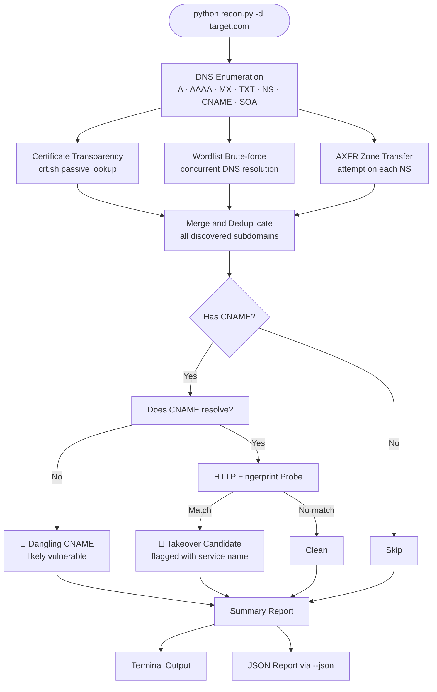

# 🔍 dns-recon

> DNS reconnaissance & subdomain takeover scanner for CTF and authorized security research.


---

[](https://github.com/rajnishanand/dns-recon)

---
https://github.com/rajnishanand/dns-recon
## What It Does

Given a target domain, `recon.py` maps its full DNS attack surface using public data sources and direct DNS queries:

- Enumerates all DNS record types — `A`, `AAAA`, `MX`, `TXT`, `NS`, `CNAME`, `SOA`
- Discovers subdomains via Certificate Transparency logs (crt.sh) — fully passive, zero contact with target
- Brute-forces subdomains using a wordlist with concurrent DNS resolution
- Attempts AXFR zone transfer from every nameserver (educational — almost always refused on hardened targets)
- Detects dangling CNAMEs pointing to unclaimed third-party services
- Fingerprints 15+ platforms for subdomain takeover candidates
- Outputs a colored terminal report and optional structured JSON

---

## How It Works



---

## Features

| Feature | Description |
|---|---|
| DNS record enumeration | All standard record types in one pass |
| CT log discovery | Queries crt.sh for historical subdomain data — no target contact |
| Wordlist brute-force | Concurrent resolution via `ThreadPoolExecutor` |
| AXFR attempt | Zone transfer against each NS — flags misconfigurations |
| Dangling CNAME detection | Checks whether CNAME targets resolve |
| Takeover fingerprinting | HTTP probes matched against 15+ platform error signatures |
| Colored terminal output | `[+]` found · `[*]` info · `[!]` warning · `[-]` error |
| JSON export | Structured machine-readable report with `--json` |
| Custom wordlists | `--wordlist path/to/list.txt` |
| Thread control | `--threads N` to tune speed vs. reliability |
| Selective scanning | `--no-axfr` · `--no-crtsh` · `--no-brute` skip flags |

---

## Requirements

- Python **3.8 or higher**
- Dependencies:

```
dnspython>=2.3.0
requests>=2.28.0
```

---

## Setup

**1. Clone the repository**

```bash
git clone https://github.com/yourusername/recon.py
cd recon.py
```

**2. Install dependencies**

```bash
pip install dnspython requests
```

Or inside a virtual environment (recommended):

```bash
python -m venv venv
source venv/bin/activate        # Linux / macOS
venv\Scripts\activate           # Windows

pip install dnspython requests
```

**3. Verify installation**

```bash
python recon.py --help
```

---

## Usage

```bash
# Basic scan
python recon.py -d example.com

# With custom wordlist
python recon.py -d example.com --wordlist wordlists/subdomains.txt

# Save JSON report
python recon.py -d example.com --json

# Faster scan — more threads, skip AXFR
python recon.py -d example.com --threads 100 --no-axfr

# Fully passive — CT logs and DNS records only, no brute-force, no AXFR
python recon.py -d example.com --no-brute --no-axfr
```

### All Flags

```
-d,  --domain       Target domain (required)
     --wordlist      Path to subdomain wordlist file
     --threads       Brute-force thread count (default: 50)
     --json          Save JSON report to <domain>_recon.json
     --no-axfr       Skip zone transfer attempt
     --no-crtsh      Skip certificate transparency lookup
     --no-brute      Skip wordlist brute-force
```

---

## Example Output

```
╔══════════════════════════════════════╗
║       DNS Recon & Takeover Scanner   ║
║       CTF / Authorized Use Only      ║
╚══════════════════════════════════════╝

  [*] Target : google.com
  [*] Time   : 2025-04-16T14:32:01

──────────────────────────────────────────────────
  DNS Record Enumeration
──────────────────────────────────────────────────
  [+] A       142.250.183.46
  [+] MX      10 smtp.google.com.
  [+] NS      ns1.google.com.
  [+] TXT     v=spf1 include:_spf.google.com ~all
  [*] CNAME   (no record)

──────────────────────────────────────────────────
  Certificate Transparency (crt.sh)
──────────────────────────────────────────────────
  [*] Querying crt.sh for *.google.com
  [+] Found 214 unique subdomains in CT logs

──────────────────────────────────────────────────
  Wordlist Brute-force (50 words, 50 threads)
──────────────────────────────────────────────────
  [+] mail.google.com                           142.250.183.83
  [+] api.google.com                            142.250.183.46
  [50/50] scanned, 12 found...

──────────────────────────────────────────────────
  Summary
──────────────────────────────────────────────────
  Target            google.com
  A records         1
  MX records        1
  NS records        4
  Subdomains found  226 (12 resolved)
  AXFR success      False

  No takeover candidates found
```

---

## JSON Report Structure

When `--json` is passed, `<domain>_recon.json` is written with this structure:

```json
{
  "target": "example.com",
  "timestamp": "2025-04-16T14:32:01",
  "dns_records": {
    "A":     ["93.184.216.34"],
    "AAAA":  [],
    "MX":    ["0 ."],
    "TXT":   ["v=spf1 -all"],
    "NS":    ["a.iana-servers.net.", "b.iana-servers.net."],
    "CNAME": [],
    "SOA":   ["ns.icann.org. noc.dns.icann.org. 2024042265 7200 3600 1209600 3600"]
  },
  "subdomains": [
    {
      "name":   "www.example.com",
      "ips":    ["93.184.216.34"],
      "cname":  null,
      "source": "wordlist"
    }
  ],
  "axfr": {
    "attempted": ["a.iana-servers.net", "b.iana-servers.net"],
    "success":   false,
    "records":   []
  },
  "takeover_candidates": []
}
```

---

## Project Structure

```
recon.py/
├── recon.py           # Main script
├── subdomains.txt     # Built-in wordlist (150 common subdomains)
└── README.md          # This file
```

The tool is intentionally a single file for readability. A production modular layout would split into:

```
dns_enum.py      # DNS record enumeration
crtsh.py         # Certificate transparency queries
bruteforce.py    # Wordlist + concurrent resolution
axfr.py          # Zone transfer attempts
takeover.py      # CNAME + fingerprint detection
report.py        # Terminal output + JSON writer
```

---

## Takeover Fingerprints

| Platform | CNAME Pattern | Detection |
|---|---|---|
| GitHub Pages | `github.io` | HTTP body |
| Heroku | `herokuapp.com` | HTTP body |
| AWS S3 | `s3.amazonaws.com` | HTTP body |
| Netlify | `netlify.app` | HTTP body |
| Azure Web Apps | `azurewebsites.net` | HTTP body |
| Azure CDN | `azureedge.net` | HTTP body |
| Fastly | `fastly.net` | HTTP body |
| Ghost | `ghost.io` | HTTP body |
| Shopify | `myshopify.com` | HTTP body |
| Surge | `surge.sh` | HTTP body |
| Webflow | `webflow.io` | HTTP body |
| ReadTheDocs | `readthedocs.io` | HTTP body |
| Zendesk | `zendesk.com` | HTTP body |
| Freshdesk | `freshdesk.com` | HTTP body |
| Pantheon | `pantheonsite.io` | HTTP body |

Detection is heuristic — always verify candidates manually before reporting.

---

## Known Limitations

- **AXFR almost always fails.** Correct behavior on properly configured nameservers. A success means the target is misconfigured, not that the tool is broken. Use `zonetransfer.me` to see a successful AXFR intentionally left open for training.
- **Thread count vs. accuracy.** Above ~100 threads, public resolvers may rate-limit queries causing false negatives. If accuracy matters more than speed, use `--threads 30`.
- **CT logs are historical.** A subdomain in crt.sh may have been deleted years ago and won't resolve. The tool flags these as `(historical CT entry)` — this is expected behavior, not a bug.
- **HTTP fingerprinting is no longer passive.** The takeover probe makes direct HTTP connections to discovered subdomains. Use `--no-brute --no-axfr` for a fully passive scan, but note that takeover detection still makes outbound requests.
- **Fingerprint matches are candidates, not confirmations.** Platform error pages change. Service behavior varies. Verify every finding manually before reporting.
- **No IPv6 brute-force.** AAAA records are enumerated for the root domain but subdomain brute-force only resolves A records.

---

## Concepts This Project Covers

Built as a structured learning exercise. Concepts covered in order of implementation:

| Stage | Concept |
|---|---|
| 1 | Python script structure, `__main__` guard, ANSI colors |
| 2 | DNS resolution chain, A records, `dnspython`, exception handling |
| 3 | All DNS record types, recon value of MX/TXT/NS/SOA |
| 4 | CLI design with `argparse`, flags, defaults, Namespace object |
| 5 | Certificate Transparency, HTTP with `requests`, passive vs active recon |
| 6 | Concurrency vs parallelism, `ThreadPoolExecutor`, `as_completed`, closures, list comprehensions |
| 7 | AXFR zone transfers, TCP vs UDP in DNS, ACL misconfigurations |
| 8 | Subdomain takeover mechanics, dangling CNAMEs, HTTP fingerprinting, guard clauses |
| 9 | JSON serialization, context managers, set comprehensions, data design |

---

## Ethical Guidelines

This tool performs active DNS queries and HTTP requests.

- Only run against domains you **own** or have **explicit written authorization** to test
- CTF targets and authorized lab environments are in scope
- Unauthorized scanning of production systems is illegal in most jurisdictions regardless of intent
- The crt.sh lookup is fully passive — it makes zero contact with the target
- DNS brute-force is low-impact but not invisible — queries reach the target's nameservers
- HTTP fingerprinting makes direct connections to discovered subdomains

If you discover a real subdomain takeover on an authorized target, report it through the organization's vulnerability disclosure program.

---

## Try It Safely

`zonetransfer.me` is intentionally misconfigured for security education. It allows AXFR and is safe to scan:

```bash
python recon.py -d zonetransfer.me --json
```

This is the only context where the AXFR module returns a full zone dump. Study the output — that's exactly what a real misconfigured nameserver leaks.

---

## License

MIT — use freely, attribute honestly, don't scan what you don't own.
